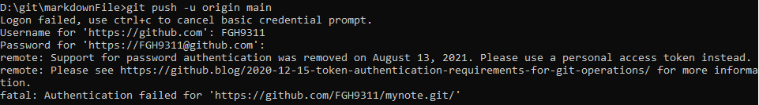
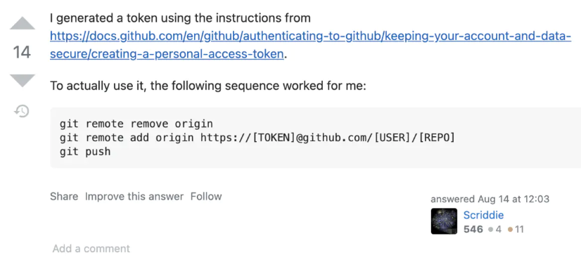
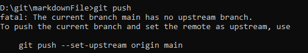
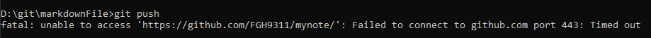

# git  Typora  搭建与笔记问题


## 搭建参考

https://blog.csdn.net/oPengXiaoLiang/article/details/100678908

有时候要翻墙才能打开github


- ## Github的git操作必须要使用token认证[from 2021.8.13]

上传出现问题




### 在stackoverflow找到解决方法

经过一番搜索，在一个帖子上找到答案

[https://stackoverflow.com/questions/18935539/authenticate-with-github-using-a-token](https://links.jianshu.com/go?to=https%3A%2F%2Fstackoverflow.com%2Fquestions%2F18935539%2Fauthenticate-with-github-using-a-token)

但我的现在需要的是push，热门回答重新clone，这不是我想要的

往下翻，试了这条建议，成功了




### 注意事项

按照上图的解决办法，在push时，可能会提示



顾名思义，分支没对齐，设置一下就好了


- ##  git push 443



这种情况可能是因为设置了系统代理, 取消全局代理即可, 亲测有效

```
git config --global --unset http.proxy
git config --global --unset https.proxy
```


- ## OpenSSL SSL_read: SSL_ERROR_SYSCALL, errno 10054

可能解决（莫明奇妙消失）

安全设置问题

```text
git config http.sslVerify "false"
```


增大缓存大小
524288000表示增至500兆，1048576000表示增至1G

```text
git config --global http.postBuffer 524288000
```